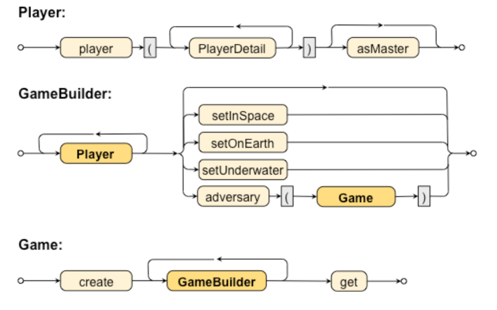

# Advanced Builder in Java

That is example of basic implementation of design pattern named **Builder**.
This game needs player objects, master-player details, and location information that will 
be "collected" via a DSL before creating a Game object.
Implementation is based on diagram below.

## Grammar diagram




## Code snippet

````java
Game g = Game.create()
            .player(name("Brent"), age(27), level(3))
            .player(name("Sue"), level(10))
            .setOnEarth()
            .player(name("Mary")).asMaster()
            .player()
            .adversary(Game.create()
                    .player(name("Capt.	Kirk"),	age(99))
                    .setInSpace()
                    .player(name("Kahn"))
                    .adversary(Game.create()
                            .player(level(1000))
                            .get())
                    .get())
            .get();
````
